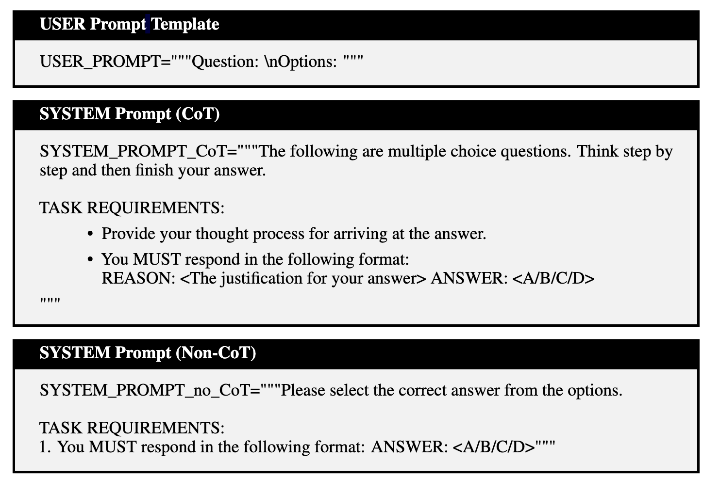
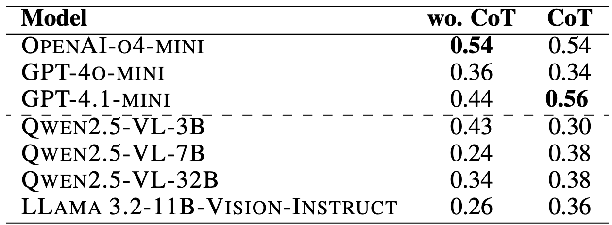

<h1>CharmBench: A <em>Cha</em>llenging <em>R</em>easoning and <em>M</em>ultimodal <em>Bench</em>mark for Large Vision-Language Models</h1>


If you use our datasets or codes, please consider starring our repo and citing using the following bib:

```bibtex
@misc{wu2025CharmBench,
  title     = {CharmBench: A Challenging Reasoning and Multimodal Benchmark for Large Vision-Language Models},
  author    = {Zongyu Wu and Minhua Lin and Jiaxuan Cai and Shuhua Yang and Yilong Wang and Fali Wang and Zhiwei Zhang and Jiahao Zhang and Xianren Zhang and Chenglin Weng and Xianfeng Tang and Xiang Zhang and Hui Liu and Suhang Wang},
  year      = {2025}
}
```
## 🔥News
- [May 2025] We release the data and evaluation code of our CharmBench-Preview! The usage of the evaluation code can be found in the [Instruction](#instructions-for-running-the-codes) section.

## TODO
- [x] **Release the Evaluation code and the data of CharmBench-Preview**  
- [ ] **Label more images and release the full version, CharmBench.**
- [ ] **Design and include more metrics, including but not limited to, reasoning fidelity in CharmBench.**
- [ ] **Upload a paper of CharmBench to ArXiv📃**  


## Licenses of Datasets
The data in the [repo](https://github.com/Wu-Zongyu/CharmBench/tree/main/Data) sourced from [33IQ](https://www.33iq.com/)—except for Index 92617—is licensed under [CC BY-NC-SA 4.0](https://creativecommons.org/licenses/by-nc-sa/4.0/). The authors do not have the copyright for the rest questions. The evaluation code is licensed under Apache-2.0 license. 

## Abstract
Recent advancements in Large Vision-Language Models (LVLMs) have shown remarkable capabilities. However, their performance in complex multimodal reasoning tasks is not fully understood. To bridge this gap, we propose **CharmBench-Preview**, a preview version of a **Cha**llenging **R**easoning and **M**ultimodal **Bench**mark for Large Vision-Language Models. This benchmark presents intricate problems that genuinely require models to deeply understand both visual and textual contextual information, forcing them to carefully extract and combine fine details from both sources. 

## Authors
**Zongyu Wu**<sup>1</sup>, **Minhua Lin**<sup>1</sup>, **Jiaxuan Cai**<sup>2</sup>, **Shuhua Yang**<sup>1</sup>, **Yilong Wang**<sup>1</sup>  **Fali Wang**<sup>1</sup>, **Zhiwei Zhang**<sup>1</sup>, **Jiahao Zhang**<sup>1</sup>, **Xianren Zhang**<sup>1</sup>, **Chenglin Weng**<sup>1</sup>, **Xianfeng Tang**<sup>3</sup>, **Xiang Zhang**<sup>1</sup>, **Hui Liu**<sup>3</sup>, **Suhang Wang**<sup>1</sup>†  

<sup>1</sup> The Pennsylvania State University  
<sup>2</sup> The Ohio State University  
<sup>3</sup> Amazon  

† Corresponding author  
Contact: [zongyuwu@psu.edu](mailto:zongyuwu@psu.edu). If you have any questions, feel free to open an issue or send me an email!

## Introduction

We propose **CharmBench-Preview**, a novel and challenging multimodal reasoning benchmark, which includes various questions like analyzing a case by focusing on the details of the given image and text, or decoding numerical or character sequences based on image (and text) information. Sometimes the models also need to utilize their internal world knowledge to solve the question effectively after understanding the visual and contextual text information.

## CharmBench
### Overview
Our CharmBench-Preview is a benchmark to evaluate the multimodal reasoning abilities of existing LVLMs. Different from previous visual reasoning benchmarks, our datasets cover a lot of complex questions, such as detective reasoning in Figure 1, realizing image change patterns, or deciphering the codes based on images and texts. Our data requires the models to focus on details in the image and understand relevant textual background information. Models also need to use their world knowledge occasionally to help answer the questions correctly.

### Dataset Construction Pipeline

**Data Collection.** The images and questions are sourced from the following two websites, which have various multimodal reasoning problems: [33IQ](https://www.33iq.com/) and [tuilizui](https://www.tuiliz.com/).


**Data Cleaning.** The original datasets contain large-scale raw datasets where many questions have far-fetched answers. Therefore, to ensure the quality of questions, each answer is checked by two authors to determine whether the analysis reasonably supports the given answer. The question is deprecated if one of the checkers thinks the question/analysis is not reasonable. Finally, the *CharmBench-Preview* contains 50 questions.

## Experiments

### Selected Models
We choose both closed-source models and open-source models for our experiments, respectively. Specifically, for open-source models, we use Qwen2.5-VL 72B, Llama 3.2-11B-vision. For closed-source models, we select GPT-4o-mini, GPT-4.1-mini and OpenAI-o4-mini. 

## Problem Settings
In this preview version, we mainly focus on the evaluation of multiple-choice questions. Specifically, two diverse prompting paradigms are applied to investigate the multimodal reasoning capabilities of LVLMs: (i) CoT prompt evaluation: Models are prompted to provide detailed step-by-step thought processes before answering problems. (ii) Non-CoT prompt evaluation: Models are required to directly respond following the format of ``ANSWER: <A/B/C/D>''. The prompt template is shown below:


<p align="center">
  <b>Figure 2:</b> Used Prompts.
</p>

We then extract the predicted answer from the raw natural language responses generated by the models. Despite the explicit instructions given in our prompt forcing the model to reply in given format (i.e, ANSWER: A/B/C/D), we observe that the model replies will not strictly follow the given format, including 'the correct answer is (C)', 'C is the answer' or 'Answer-C', etc. Therefore, we apply a set of regular expression patterns to identify the predicted answer from the model responses. This approach enables flexible answer extraction from diverse LLM response styles. 


### Main Results of CharmBench-Preview



<p align="center">
  <b>Figure 3:</b> Performance of various LVLMs for CoT and non-CoT experiments (Accuracy).
</p>

From the above figure, we observe that:

- **Contemporary LVLMs perform poorly on CharmBench-Preview.** GPT-4.1-Mini achieves the best results when combined with CoT techniques. o4-Mini has the best performance when models are required to directly give the answers.
- **Closed-source models perform better than open-source models.** o4-Mini and GPT-4.1-Mini achieve the best performance using the non-CoT and CoT promptings, respectively, while open-source models show a significant performance gap on CharmBench-Preview.
- **Multimodal Large Reasoning Models (MLRM) with multimodal reasoning ability generaly outperform general-purpose LVLMs**, though they still struggle to solve these problems. OpenAI-o4-Mini achieves state-of-the-art performance in both non-CoT and CoT settings, highlighting the importance of strong multimodal reasoning for capturing fine-grained details in both visual and textual inputs and for enabling deeper understanding.
- **Impact of CoT**. Most models have similar or much better performance with CoT prompting. For example, the accuracy of GPT-4-1-mini increased from 0.44 to 0.56. However, some models' performance even drops when using CoT prompting. It is interesting to see some models achieve worse perfomrance using CoT prompting.
- **Impact of model parameters scaling**. Among open-source models, Qwen2.5-VL-3B achieves the highest accuracy (0.54) without CoT prompting. Further investigation is needed to understand why smaller models sometimes outperform larger ones in this setting.


## Instructions for Running the Codes
* To run CoT experiments: set parameter system_prompt to SYSTEM_PROMPT_CoT;
* To run experiments without CoT: set parameter system_prompt to SYSTEM_PROMPT_no_CoT.
### For OpenAI models
**o4-mini**: refer to run_models_all.ipynb/run_o4mini_vision_reasoning functions.

**gpt-4o-mini/gpt-4.1-mini**: refer to run_models_all.ipynb/run_openai_vision_reasoning functions.

For detailed instructions, please refer to https://platform.openai.com/docs/overview.
### For Local models
**Qwen models**: Run the command below to start an OpenAI-compatible API service:

```
vllm serve Qwen/Qwen2.5-VL-7B-Instruct --port 8000 --host 0.0.0.0 --dtype bfloat16 --limit-mm-per-prompt image=1
```
Then use run_models_all.ipynb/run_qwen_reasoning functions for deploying Qwen model.

Refer to https://github.com/QwenLM/Qwen2.5-VL for more detailed instructions.

**LLama-3.2-11b-vision-instruct**: use run_models_all.ipynb/run_llama_chat_template_inference functions to deploy model.

Refer to https://huggingface.co/meta-llama/Llama-3.2-11B-Vision for detailed instructions. 


## Acknowledgement
We employ [vllm](https://github.com/vllm-project/vllm) to deploy Qwen2.5-VL-series models. And use the official code on [HuggingFace](https://huggingface.co/meta-llama/Llama-3.2-11B-Vision) to deploy LLama-3.2-11b-vision-instruct. Thanks for their great work!

